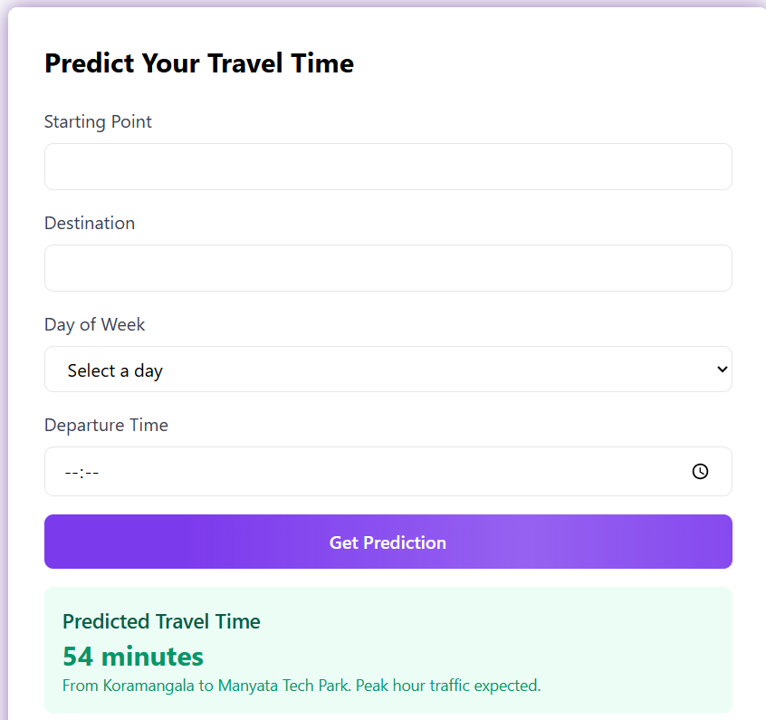
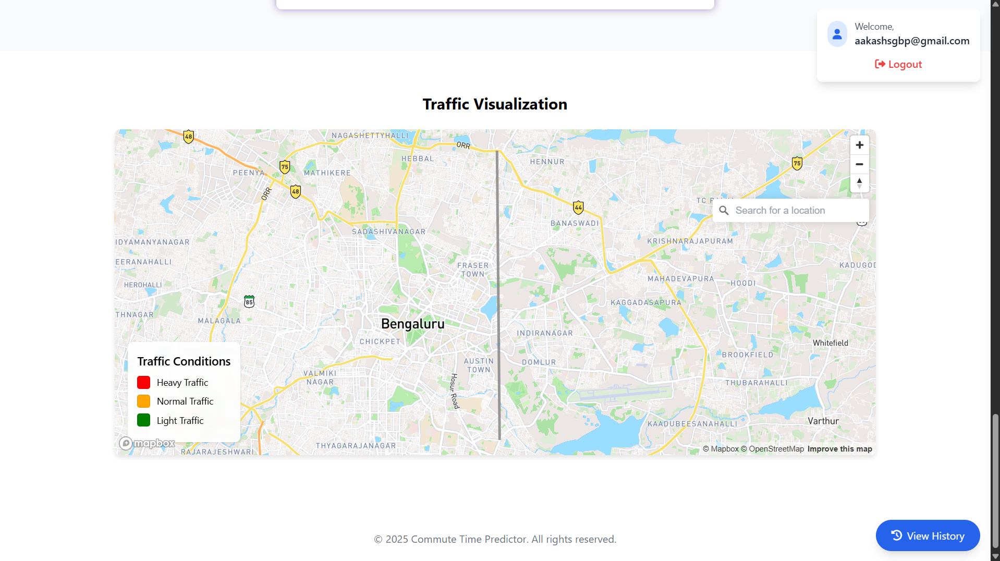

# 🚗 Commute Time Predictor

A modern web application that provides accurate travel time predictions using advanced AI technology and real-time traffic data.


## ✨ Features

- **🎯 Accurate Predictions**: Get precise travel time estimates using machine learning algorithms
- **🗺️ Interactive Maps**: Real-time traffic visualization using Mapbox
- **📊 Historical Data**: View and analyze your past predictions
- **🔐 User Authentication**: Secure login and registration system using Supabase
- **📱 Responsive Design**: Beautiful UI that works seamlessly across all devices
- **🌐 Real-time Updates**: Live traffic condition updates

## 📸 Screenshots

### Home Page


### Prediction Interface


### Traffic Visualization


## 🚀 Getting Started

### Prerequisites

- Python 3.8 or higher
- Node.js and npm (for frontend dependencies)
- Supabase account
- Mapbox API key

### Installation

1. Clone the repository:
   ```bash
   git clone https://github.com/yourusername/commute-time-predictor.git
   cd commute-time-predictor
   ```

2. Set up the backend:
   ```bash
   cd Trial3/backend
   pip install -r requirements.txt
   ```

3. Configure environment variables:
   Create a `.env` file in the backend directory:
   ```env
   SUPABASE_URL=your_supabase_url
   SUPABASE_KEY=your_supabase_anon_key
   SUPABASE_SERVICE_KEY=your_supabase_service_key
   ```

4. Set up the frontend:
   ```bash
   cd ../frontend
   ```
   Update the Mapbox access token in `index.html`
   Update Supabase credentials in `auth.js`

5. Start the backend server:
   ```bash
   cd ../backend
   python app.py
   ```

6. Open `index.html` in your browser or serve it using a local server.

## 🏗️ Project Structure

```
commute-time-predictor/
├── Trial3/
│   ├── backend/
│   │   ├── app.py
│   │   ├── requirements.txt
│   │   └── .env
│   └── frontend/
│       ├── index.html
│       └── auth.js
```

## 🔧 Configuration

### Supabase Setup

1. Create a new Supabase project
2. Set up the following tables:
   - `predictions` - Stores user prediction history
   - Enable Row Level Security (RLS)
3. Configure authentication:
   - Enable email authentication
   - Set up email templates

### Mapbox Setup

1. Create a Mapbox account
2. Get your public access token
3. Replace the token in `index.html`

## 🎨 Features in Detail

### Prediction System
- Day of week selection
- Departure time input
- Real-time traffic consideration
- Historical data analysis

### Traffic Visualization
- Color-coded traffic conditions
- Interactive map interface
- Real-time updates
- Traffic density indicators

### User Dashboard
- Prediction history
- Personal statistics
- Route preferences
- Account management

## 👥 Team

- **Aakash Singh** - AI Specialist
- **Ananya Kanthraj** - Frontend Developer
- **Bhoomika Mohan** - Backend Developer
- **Aditya Anjan Jha** - Machine Learning Engineer

## 🤝 Contributing

1. Fork the repository
2. Create your feature branch (`git checkout -b feature/AmazingFeature`)
3. Commit your changes (`git commit -m 'Add some AmazingFeature'`)
4. Push to the branch (`git push origin feature/AmazingFeature`)
5. Open a Pull Request

## 📝 License

This project is licensed under the MIT License - see the [LICENSE](LICENSE) file for details.

## 🙏 Acknowledgments

- [Supabase](https://supabase.io/) for authentication and database
- [Mapbox](https://www.mapbox.com/) for maps and traffic data
- [TailwindCSS](https://tailwindcss.com/) for styling
- All contributors and testers

## 📞 Contact

For any queries or support, please contact:
- Email: your.email@example.com
- Project Link: https://github.com/yourusername/commute-time-predictor

---
Made with ❤️ by the Syntax Squad 